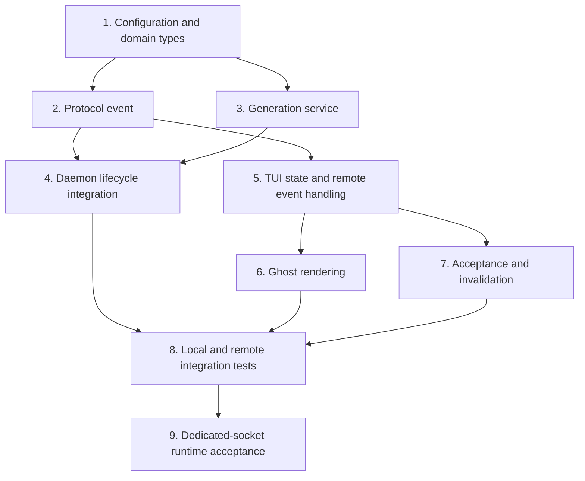

# Native Prompt Suggestions Implementation Plan

**Design:** `docs/superpowers/specs/2026-08-25-native-prompt-suggestions-design.md`

## Outcome

After each finalized successful interactive turn, the daemon asynchronously generates a bounded next-prompt suggestion. Local and remote TUI clients receive the same session-scoped event, render compatible ghost text in an empty composer, and accept it with `Tab` or `Right Arrow` without submitting.

## Dependency graph

## Task 1: Configuration and domain types

**Primary files:**
- `crates/jcode-base/src/config.rs`
- configuration defaults, parsing, change-report, and documentation files discovered during implementation

Add a serializable `PromptSuggestionsConfig` with defaults for enabled state, optional model route, reasoning effort, maximum characters, and acceptance keys. Follow existing global/project precedence rather than creating a feature-specific config store. Model invalid modes explicitly and clamp unsafe maximum lengths at the config boundary.

Add pure domain helpers for eligibility, output normalization, no-suggestion sentinel recognition, and bounded UTF-8 truncation. Keep these outside the TUI so server and tests share one contract.

**Verification:** config deserialization/default/override tests, invalid acceptance-key tests, UTF-8 length tests, eligibility matrix.

## Task 2: Protocol event

**Primary files:**
- `crates/jcode-protocol/src/wire.rs`
- protocol serialization tests and any generated/version compatibility fixtures

Add a backward-compatible `ServerEvent::PromptSuggestionUpdated` carrying session identity, monotonically increasing generation, and `Option<String>`. `None` clears existing state. Ensure older clients can ignore the additive event according to current protocol behavior.

**Verification:** JSON round-trip tests for populated and clearing events, protocol compatibility tests.

## Task 3: Cancellable generation service

**Primary area:** `crates/jcode-app-core/src/server/` or a narrower daemon-owned module selected from existing service patterns.

Implement `PromptSuggestionService` as a per-session state machine:
- generation counter;
- one cancellable task per session;
- final stale-result comparison;
- compact context builder;
- provider/model route resolution;
- strict plain-text output validation;
- privacy-safe diagnostics.

Use existing provider construction and simple-completion APIs. Do not hold session or broadcaster locks across network awaits. Default-route selection must use an authenticated lightweight route available to the current runtime and fail silently when none exists.

**Verification:** injected completion function tests for success, sentinel, failure, cancellation, stale completion, unavailable route, and oversized output.

## Task 4: Daemon turn-lifecycle integration

**Primary areas:**
- finalized turn handling in `crates/jcode-app-core/src/agent/turn_streaming_mpsc.rs`
- session/client lifecycle in `crates/jcode-app-core/src/server/`

Trigger generation only after final successful turn bookkeeping, never directly on provider `MessageEnd`. Exclude failed, aborted, debug, scripted, headless, and non-interactive runs. Broadcast results only to the owning session. Cancel on newer turns, user input submission, session closure, or connection teardown where those events are daemon-visible.

Preserve turn latency by spawning after finalization and never awaiting suggestion completion in the turn path.

**Verification:** lifecycle tests prove exactly one request per eligible turn, none for excluded statuses, newer generations supersede older work, and disconnect/session close cancels work.

## Task 5: TUI suggestion state and protocol handling

**Primary files:**
- `crates/jcode-tui/src/tui/app.rs`
- `crates/jcode-tui/src/tui/app/remote/server_events.rs` and/or focused handlers
- local turn completion bridge used by `crates/jcode-tui/src/tui/app/turn.rs`

Add a small `PromptSuggestionState` separate from `input`, containing session identity, generation, and suggestion text. Centralize `set`, `clear`, `is_compatible`, and `accept` operations. Apply only newer events for the active session. Route both local and remote completions through the same state-update contract so behavior cannot drift.

**Verification:** state transition tests for session mismatch, stale generations, clearing, and replacement.

## Task 6: Ghost rendering

**Primary files:**
- `crates/jcode-tui/src/tui/ui_input.rs`
- focused helper module if needed to avoid adding lifecycle logic to the large renderer

Extend composer layout to account for ghost text only when the input is empty and no incompatible modal, overlay, shell mode, history search, pending input, or interactive picker owns the composer. Render dim text after the existing prompt prefix using the same multiline wrapping width as editable input. Do not include ghost text in selection/copy snapshots or cursor calculations.

**Verification:** buffer/frame tests for single-line, multiline, wrapping, narrow terminal, overlay suppression, and selection/cursor exclusion.

## Task 7: Acceptance and invalidation

**Primary files:**
- `crates/jcode-tui/src/tui/app/input.rs`
- `crates/jcode-tui/src/tui/app/remote/key_handling.rs`
- input mutation helpers and session-switch handlers

Intercept unmodified `Tab` and `Right Arrow` before their existing basic-key behavior only when a compatible ghost is visible. Acceptance copies the full suggestion into `input`, moves the cursor to the end, clears suggestion state, and requests redraw without submission. Otherwise preserve model switching and cursor motion exactly.

Clear suggestions through centralized input/session mutation boundaries for typing, paste, submission, session/branch changes, incompatible modes, and disablement. Avoid scattered field writes that can miss remote paths.

**Verification:** local and remote key tests prove acceptance and fallback behavior, plus invalidation for typing, paste, submit, escape/session switch, and stale events.

## Task 8: Integration and regression coverage

Add integration coverage across:
- daemon event generation and serialization;
- local TUI application;
- remote server event handling;
- concurrent generations and stale-result rejection;
- provider failure and absent lightweight route;
- configuration precedence and live reload behavior where supported;
- existing `Tab` model switching and `Right Arrow` cursor navigation;
- composer copy, mouse positioning, multiline height, overlays, and queued-message states.

Run focused crate tests first, then the relevant TUI and app-core suites. Fix regressions before proceeding.

## Task 9: Build, reload, and end-user acceptance

Use `selfdev build-reload target=tui`. After reload, create a dedicated debug-socket tester or dedicated daemon socket and exercise the real workflow:

1. complete an ordinary assistant turn;
2. observe automatic ghost text in the empty composer;
3. accept with `Tab` and confirm text is inserted but not submitted;
4. repeat and accept with `Right Arrow`;
5. verify `Tab` still switches models without a ghost;
6. verify `Right Arrow` still moves the cursor without a ghost;
7. type before a delayed result and confirm no stale ghost appears;
8. switch sessions and confirm suggestions do not leak;
9. exercise a remote session and confirm protocol parity;
10. disable the feature and confirm generation/rendering stops.

Capture debug frames and observable protocol/state evidence. Runtime acceptance is complete only when these workflows pass against the rebuilt binary, not merely unit tests.

## Commit sequence

1. `feat(config): add prompt suggestion settings`
2. `feat(protocol): add prompt suggestion events`
3. `feat(server): generate cancellable prompt suggestions`
4. `feat(tui): render and accept prompt suggestion ghosts`
5. `test: cover prompt suggestion integration paths`
6. `docs: record prompt suggestion runtime behavior`

Each commit must compile and keep existing behavior intact for clients that receive no suggestion event.
